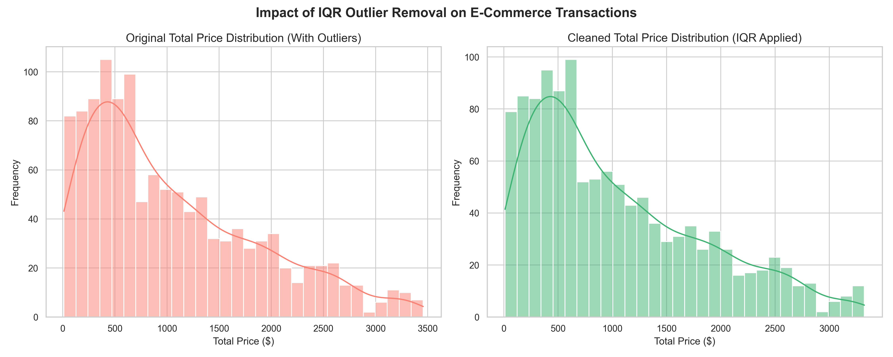

# 🚀 Advanced EDA & Feature Engineering: E-Commerce Data

# 📌 Project Overview
This repository contains my first project as a Data Analytics Intern at Decode Labs. The goal of this project was to transform a raw, chaotic e-commerce dataset into a mathematically clean foundation ready for machine learning algorithms. 

Instead of just running basic functions, this pipeline utilizes statistical logic to handle missing values, neutralize outliers and engineer predictive features.

### 📊 Visualizing the Mathematical Impact

# 🧮 Mathematical Approach & Methodology

## 1. Statistical Imputation
* **Numerical Data:** Applied K-Nearest Neighbors (KNN) Imputation (`n_neighbors=5`) to safely estimate any structural gaps based on feature similarity.
* **Categorical Data:** Replaced missing `CouponCode` values using a mode-like constant replacement (`"NO_COUPON"`).

## 2. Outlier Neutralization (IQR Method)
Because financial data (`TotalPrice`) is often heavily skewed by bulk orders, I utilized the Interquartile Range (IQR) method rather than standard Z-scores to filter anomalies.
* Calculated the 25th (Q1) and 75th (Q3) percentiles.
* Filtered out data points falling outside `1.5 * IQR`.

## 3. Feature Engineering
Engineered three distinct predictive signals for future modeling:
* **`Avg_Item_Value`**: A continuous ratio feature dividing `TotalPrice` by `ItemsInCart`.
* **`Is_Weekend`**: A binary temporal feature extracted from the `Date` timestamp (1 = Weekend, 0 = Weekday).
* **`Used_Coupon`**: A binary categorical feature indicating promotional engagement.

# 📊 Results & Output
The data pipeline successfully cleaned the dataset without massive data loss:
**Original Dataset Shape:** 1200 rows, 14 columns
**Missing Values Handled:** 100% missing data resolved
**Outliers Removed:** 8 extreme anomalies neutralized
**Final Cleaned Dataset:** 1192 high-quality rows

**Sample of Engineered Features:**
   TotalPrice	 ItemsInCart     Avg_Item_Value	     Date	    Is_Weekend  Used_Coupon
0	2853.10	          7.0	        407.585714	   2023-01-04	    0	        1
1	302.70	          3.0	        100.900000	   2024-08-23	    0	        1
2	2753.40	          8.0	        344.175000	   2024-02-27	    0	        1
3	273.19	          5.0	        54.638000	   2023-10-15	    1	        1
4	2504.04	          8.0	        313.005000	   2025-05-08	    0	        1

## ⚙️ How to Run
1. Clone the repository to your local machine.
2. Install the required dependencies using `pip install -r requirements.txt`.
3. Run the main script: `python "Python Code- Project 01.py"`
